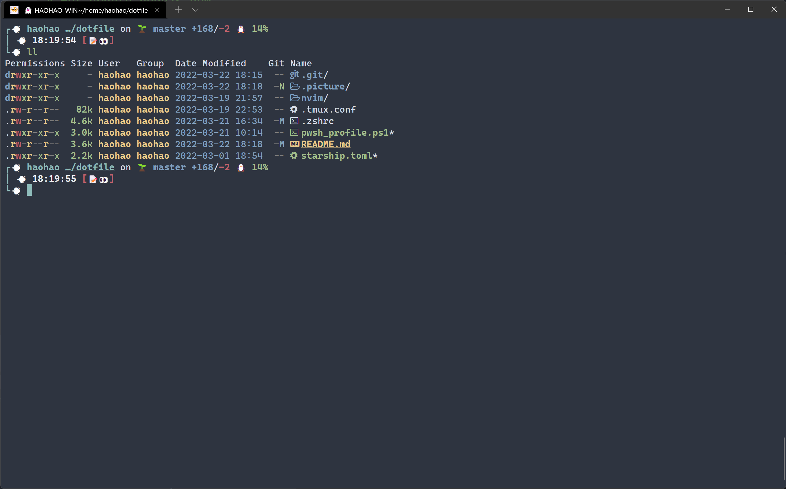
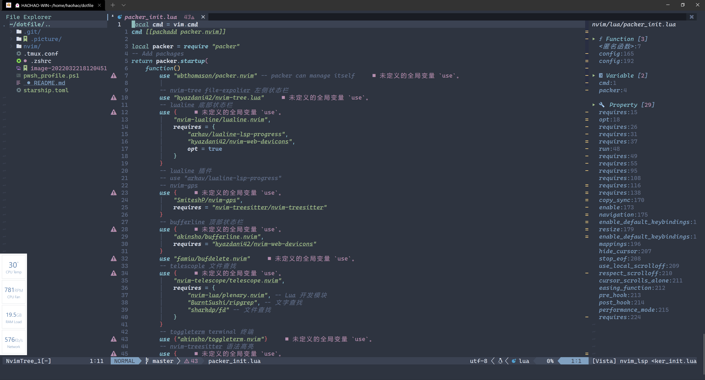
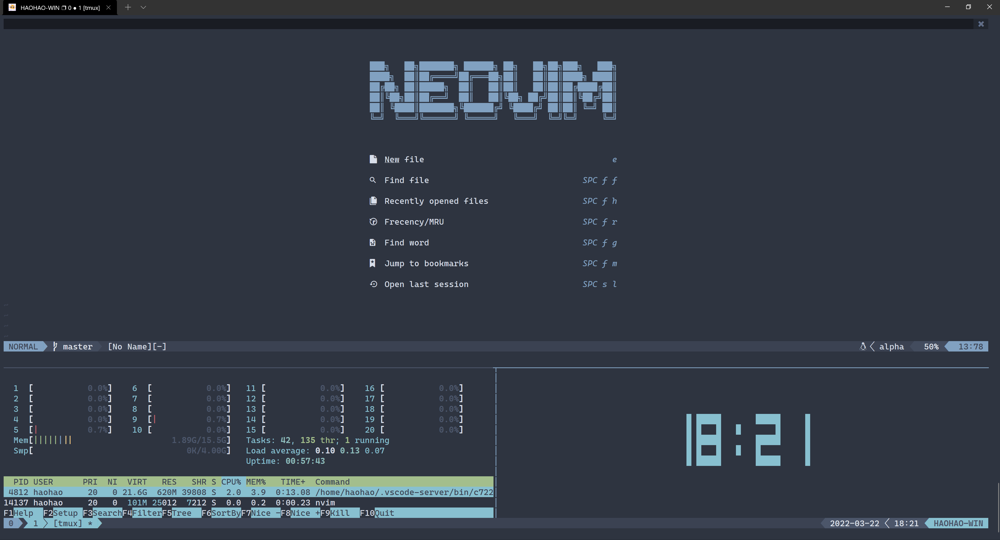
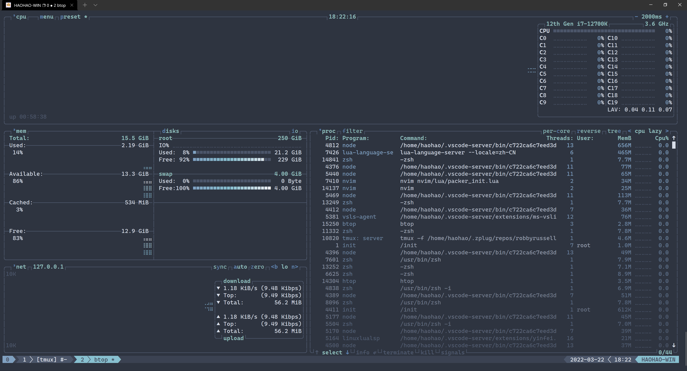
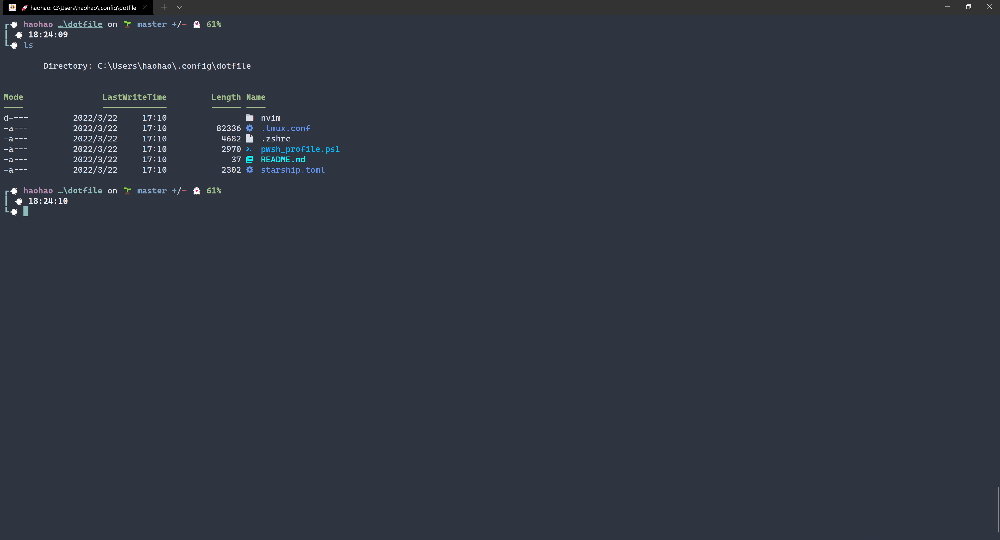

# My dotfiles

## linux needed

```bash
# for ubuntu
# shell
sudo apt-get install zsh
# git
sudo apt-get install git
# compress
sudo apt-get install tar gzip
# http
sudo apt-get install curl wget httpie
# tools for searching
sudo apt-get install fzf ripgrep gawk
# for cd
sudo apt-get install autojump
# tmux
sudo apt-get install tmux
# development
sudo apt install build-essential cmake libboost-all-dev
# top
sudo apt install htop
# tldr thefuck
sudo apt install tldr thefuck
# duf
sudo apt install duf
# all in one
sudo apt-get install zsh git tar gzip curl wget httpie fzf ripgrep gawk autojump tmux build-essential cmake libboost-all-dev htop tldr thefuck duf
```

```bash
# sshd
sudo apt-get install openssh-server
sudo systemctl enable ssh
sudo systemctl start ssh
```

```bash
# fd -> find
# https://github.com/sharkdp/fd/releases
wget https://github.com/sharkdp/fd/releases/download/v8.3.2/fd-musl_8.3.2_amd64.deb
sudo dpkg -i fd-musl_8.3.2_amd64.deb
```

```bash
# bat -> cat
# https://github.com/sharkdp/bat/releases
wget https://github.com/sharkdp/bat/releases/download/v0.20.0/bat-musl_0.20.0_amd64.deb
sudo dpkg -i bat-musl_0.20.0_amd64.deb
```

```bash
# exa -> ls
# https://github.com/ogham/exa/releases
wget https://github.com/ogham/exa/releases/download/v0.10.1/exa-linux-x86_64-musl-v0.10.1.zip
sudo unzip -q exa-linux-x86_64-musl-v0.10.1.zip bin/exa -d /usr/local
```

```bash
# for ubuntu nodejs npm
curl -sL https://deb.nodesource.com/setup_14.x | sudo -E bash -
sudo apt-get update
sudo apt-get install nodejs
```

```bash
# gdu -> du
sudo add-apt-repository ppa:daniel-milde/gdu
sudo apt-get update
sudo apt-get install gdu
```

```bash
# for ubuntu neovim
sudo add-apt-repository ppa:neovim-ppa/unstable
sudo apt-get update
sudo apt-get install neovim
```

```bash
sudo snap install btop --edge
```

```bash
conda install -c conda-forge lazygit
```

## zsh



1. 插件管理：[zplug](https://github.com/zplug/zplug)

   ```bash
   $ curl -sL --proto-redir -all,https https://raw.githubusercontent.com/zplug/installer/master/installer.zsh | zsh
   ```
2. 提示符：[Starship](https://starship.rs/)

   ```bash
   # for linux
   curl -sS https://starship.rs/install.sh | sh
   # for windows
   scoop install starship
   # for macOS
   brew install starship
   ```

## neovim



```bash
~/.config/nvim/
	-- lua
		-- core
			-- colors.lua # theme
			-- config.lua # basic config
			-- keybinds.lua # keybings
			-- settings.lua # someelse
		-- dap
			-- python.lua
		-- lsp
			-- jsonls.lua # json
			-- pyright.lua # python
			-- sumeko_lua.lua # lua
			-- zeta_note.lua # markdown
		-- plugins
			-- alpha-nvim.lua # nvim dashboard
			-- AutoSave.lua # autosave file
			-- bufferline.lua # nvim tab
			-- Comment.lua # nvim comment
			-- fidget.lua # show lsp
			-- gitsigns.lua # show git sings in line
			-- hop.lua # search word or character
			-- indent-blankline.lua # indent
			-- lsp_signature.lua # lsp
			-- lspsage.lua # lsp theme
			-- lualine.lua # nvim line
			-- marks.lua # show marks in nvim
			-- neoformat.lua # format file
			-- nvim-autopairs.lua
			-- nvim-cmp.lua # cmp like vscode
			-- nvim-dap-ui.lua
			-- nvim-dap-virtual-text.lua
			-- nvim-dap.lua
			-- nvim-gps.lua
			-- nvim-hlslens.lua
			-- nvim-lastplace.lua
			-- nvim-lightbulb.lua
			-- nvim-lspconfig.lua
			-- nvim-notify.lua
			-- nvim-scrollbar.lua
			-- nvim-tree.lua
			-- nvim-treesitter.lua
			-- onenord.lua
			-- packer_compiled.lua
			-- surround.lua
			-- telescope.lua
			-- toggleterm.lua
			-- undotree.lua
			-- vista.lua
			-- which-key.lua
		-- packer_init.lua
```

1. packer 插件管理

   ```bash
   # for linux or unix
   git clone --depth 1 https://github.com/wbthomason/packer.nvim\
    ~/.local/share/nvim/site/pack/packer/start/packer.nvim
   # for pwsh
   git clone https://github.com/wbthomason/packer.nvim "$env:LOCALAPPDATA\nvim-data\site\pack\packer\start\packer.nvim"
   ```
2. 共享系统剪切板

   ```
   sudo apt install xsel
   ```
3. neoformat

   ```bash
   python: sudo apt install python3-autopep8
   lua: npm install -g lua-fmt
   html css vue js ts json: npm install -g prettier
   ```
4. dap

   ```bash
   python: python3 -m pip install debugpy

   -- 指定 Python 解释器路径
   -- 修改lua/core/settings.lua
   vim.g.python_path = "/usr/bin/python3.8"
   ```

## tmux

**tmux+nvim**



**btop**



## pwsh



[Windows-Terminal](https://github.com/microsoft/terminal)

[PowerShell](https://github.com/PowerShell/PowerShell)

```
# install scoop
Invoke-Expression (New-Object System.Net.WebClient).DownloadString('https://get.scoop.sh')
Set-ExecutionPolicy RemoteSigned -scope CurrentUser

# install tools
scoop install git curl wget starship fzf torch sudo

# install psreadline
Install-Module -Name PSReadLine -AllowPrerelease

# install psfzf
Install-Module PSFzf

# install terminal-icon
Install-Module -Name Terminal-Icons -Repository PSGallery

# install psconsoletheme
Install-Module PSConsoleTheme
```
